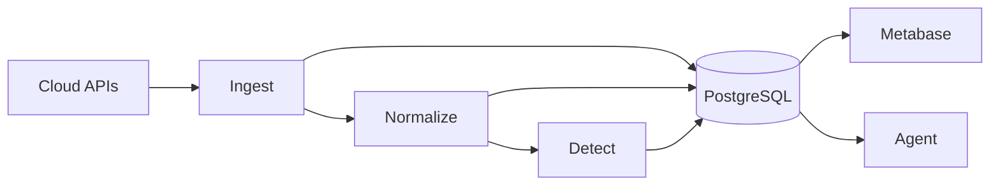

# Hotpot

**Unified security data platform for multi-cloud environments.**

Hotpot throws your cloud security data into one pot.

Raw ingredients from GCP, AWS, and on-prem sources simmer through bronze, silver, and gold layers—coming out as actionable insights, compliance reports, and AI-powered answers.

Just ask:
- *"Which VMs exist in GCP but are missing from SentinelOne?"*
- *"What firewall rules reference instances that no longer exist?"*

...and get results.

## Features

- **Multi-cloud ingestion** - GCP (Compute, IAM, Resource Manager), with VNG Cloud, SentinelOne, Fortinet planned
- **Asset inventory** - Track VMs, disks, networks, projects with change history (SCD Type 4)
- **Durable workflows** - Temporal-based pipelines with automatic retries and session management
- **AI-powered queries** - Natural language to SQL via WrenAI + Ollama
- **Hot-reload config** - Vault or file-based configuration with live database reconnection

## Data Flow

| Layer | Schema | Purpose |
|-------|--------|---------|
| Bronze | `bronze.*` | Raw data from APIs, preserved as-is |
| Silver | `silver.*` | Normalized, unified asset models |
| Gold | `gold.*` | Alerts, compliance reports, analytics |

## Tech Stack

| Component | Technology |
|-----------|------------|
| Language | Go |
| Workflows | Temporal |
| Database | PostgreSQL + GORM |
| Admin UI | Metabase |
| Agent | WrenAI + Ollama / Vertex AI |
| Config | Vault / JSON file with hot-reload |

## Documentation

| Document | Description |
|----------|-------------|
| [Architecture](docs/architecture/OVERVIEW.md) | System design, project structure |
| [Admin](docs/ADMIN.md) | Metabase setup |
| [Agent](docs/features/AGENT.md) | Text-to-SQL interface |
| [Workflows](docs/guides/WORKFLOWS.md) | Temporal workflow patterns |
| [Contributing](docs/CONTRIBUTING.md) | Contribution guidelines |

## License

Apache 2.0 - see [LICENSE](LICENSE).

If you use Hotpot, please keep the copyright notice and give credit to the original author.
