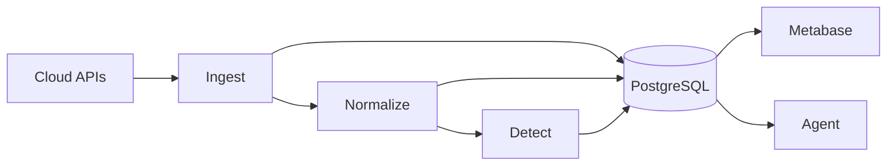

# 🍲 Hotpot

Unified security data platform for multi-cloud environments.

Hotpot throws your cloud security data into one pot.

Raw ingredients from GCP, AWS, and on-prem sources simmer through bronze, silver, and gold layers — coming out as actionable insights, compliance reports, and AI-powered answers.

Just ask:

> "Which VMs exist in GCP but are missing from SentinelOne?"
>
> "What firewall rules reference instances that no longer exist?"

...and get results.

## 🚀 Features

- **Multi-cloud ingestion** — GCP (Compute, IAM, Resource Manager, VPC Access), with AWS and VNG Cloud planned
- **Asset inventory** — Track VMs, disks, networks, projects with change history (SCD Type 4)
- **Durable workflows** — Temporal-based pipelines with automatic retries and rate limiting
- **AI-powered queries** — Natural language to SQL via WrenAI + Ollama
- **Hot-reload config** — Vault or YAML-based configuration with live database reconnection

## 🏗️ Architecture

| Layer | Schema | Purpose |
|-------|--------|---------|
| Bronze | `bronze.*` | Raw API data, preserved as-is |
| Silver | `silver.*` | Normalized, unified asset models |
| Gold | `gold.*` | Alerts, compliance, analytics |

## ⚙️ Tech Stack

| Component | Technology |
|-----------|------------|
| Language | Go |
| Workflows | Temporal |
| ORM | Ent (type-safe, code-first) |
| Database | PostgreSQL (multi-schema) |
| Admin UI | Metabase |
| Agent | WrenAI + Ollama / Vertex AI |
| Config | Vault / YAML with hot-reload |

## 📖 Documentation

| Document | Description |
|----------|-------------|
| [Architecture](docs/architecture/OVERVIEW.md) | System design, project structure |
| [Principles](docs/architecture/PRINCIPLES.md) | Architecture rules and patterns |
| [Activities](docs/guides/ACTIVITIES.md) | Adding new resource pipelines |
| [Ent Schemas](docs/guides/ENT_SCHEMAS.md) | Schema patterns for bronze and history |
| [Code Style](docs/guides/CODE_STYLE.md) | Coding conventions |
| [Configuration](docs/setup/CONFIGURATION.md) | Vault/YAML config setup |
| [Migrations](docs/setup/MIGRATIONS.md) | Database migration guide |
| [Contributing](docs/CONTRIBUTING.md) | Contribution guidelines |

## 📋 License

Apache 2.0 — see [LICENSE](LICENSE).
