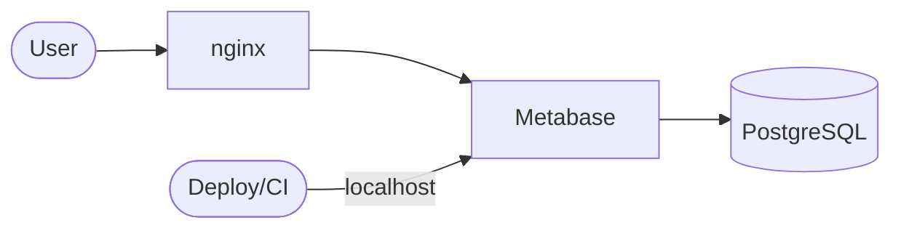

# Admin

Web interface for viewing Hotpot data.



## Stack

| Need | Tool |
|------|------|
| Data tables, filtering, export | Metabase |
| Dashboards, charts | Metabase |

No custom UI development required.

## Metabase Features

| Feature | Supported |
|---------|-----------|
| Table view with pagination | Yes |
| Column filtering | Yes |
| Sorting | Yes |
| Dashboards | Yes |
| Charts | Yes |
| Export CSV/JSON | Yes |
| Row drill-down | Yes |

## Gold Tables

Detect workflows create pre-computed tables. Metabase displays them directly.

| Gold Table | Description |
|------------|-------------|
| `gold.unprotected_assets` | VMs without EDR agent |
| `gold.expiring_certificates` | Certs with `days_remaining` column |
| `gold.uncorrelated_ips` | IPs in firewall rules but not in inventory |
| `gold.alerts` | Pre-calculated severity |
| `gold.compliance_summary` | Aggregated compliance status |

## Access Control

| Path | External | Localhost |
|------|----------|-----------|
| Metabase UI (`/`) | Allowed | Allowed |
| Metabase API (`/api/*`) | Blocked | Allowed |

## Configuration

Dashboard import via localhost API during deploy:

```bash
curl -X POST "http://localhost:3000/api/dashboard" \
  -H "X-Metabase-Session: $SESSION" \
  -d @config/dashboards/main.json
```

### Saved Questions

| Name | Table | Filter |
|------|-------|--------|
| Expiring Certificates (30d) | `gold.expiring_certificates` | `days_remaining < 30` |
| Unprotected Assets | `gold.unprotected_assets` | - |
| High Severity Alerts | `gold.alerts` | `severity = 'high'` |
