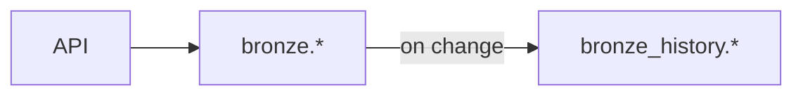

# History

Change tracking using SCD Type 4 (separate history schema).



## Schemas

| Schema | Purpose | Retention |
|--------|---------|-----------|
| `bronze` | Current state | Always |
| `bronze_history` | All versions | Configurable |
| `silver` / `silver_history` | Normalized | Configurable |
| `gold` / `gold_history` | Analytics | Indefinite |

## Linking Strategy

| Resource | Has API ID? | History Link |
|----------|-------------|--------------|
| Instance | ✓ | `resource_id` + time range |
| NIC, Disk | ✗ | `instance_history_id` + time range |
| AccessConfig | ✗ | `nic_history_id` + time range |

**Rule:** API ID → direct lookup. No API ID → parent history chain.

**All levels have `valid_from/valid_to`** for granular tracking.

## Granular Tracking

When only a nested child changes:

```
T1: Instance + NIC + AccessConfig created
T2: Only AccessConfig.NatIP changes

At T2:
- instance_history: unchanged
- nic_history: unchanged
- access_config_history: new record, links to SAME nic_history_id
```

## Table Structure

```sql
-- Current
bronze.gcp_compute_instances (
    resource_id PRIMARY KEY,
    name, status, collected_at
)

-- History (all levels have time range)
bronze_history.gcp_compute_instances (
    history_id PRIMARY KEY,
    resource_id, valid_from, valid_to,
    name, status, collected_at
)

bronze_history.gcp_compute_instance_nics (
    history_id PRIMARY KEY,
    instance_history_id,
    valid_from, valid_to,  -- own time range
    name, network
)
```

## History Chain

```
bronze_history.gcp_compute_instances
├── gcp_compute_instance_disks
│   └── gcp_compute_instance_disk_licenses
├── gcp_compute_instance_nics
│   ├── gcp_compute_instance_nic_access_configs
│   └── gcp_compute_instance_nic_alias_ranges
├── gcp_compute_instance_labels
├── gcp_compute_instance_tags
├── gcp_compute_instance_metadata
└── gcp_compute_instance_service_accounts
```

All tables have `valid_from/valid_to` columns.

## Queries

**State at specific time:**
```sql
SELECT * FROM bronze_history.gcp_compute_instances ih
JOIN bronze_history.gcp_compute_instance_nics nh
    ON nh.instance_history_id = ih.history_id
    AND @time BETWEEN nh.valid_from AND COALESCE(nh.valid_to, NOW())
WHERE ih.resource_id = '123'
    AND @time BETWEEN ih.valid_from AND COALESCE(ih.valid_to, NOW())
```

**All versions:**
```sql
SELECT resource_id, status, valid_from, valid_to
FROM bronze_history.gcp_compute_instances
WHERE resource_id = '123'
ORDER BY valid_from DESC
```

## Flow

| Event | Current Table | History Table |
|-------|---------------|---------------|
| New | INSERT | INSERT (valid_to=null) |
| Update | UPDATE | Close old, INSERT new |
| Delete | DELETE | Close (valid_to=now) |

Children: if changed → close old + insert new. If unchanged → no action.

## Models

| Package | Schema | Example |
|---------|--------|---------|
| `bronze/` | `bronze.*` | `GCPComputeInstance` |
| `bronze_history/` | `bronze_history.*` | `GCPComputeInstance` |

History models have `HistoryID`, `ValidFrom`, `ValidTo` + parent link.

## Why Type 4?

| Type | Approach | Trade-off |
|------|----------|-----------|
| Type 1 | Overwrite | No history |
| Type 2 | Flags in same table | Complex queries |
| **Type 4** | Separate schema | Clean separation |

Benefits: clean current tables, independent retention, granular tracking.
