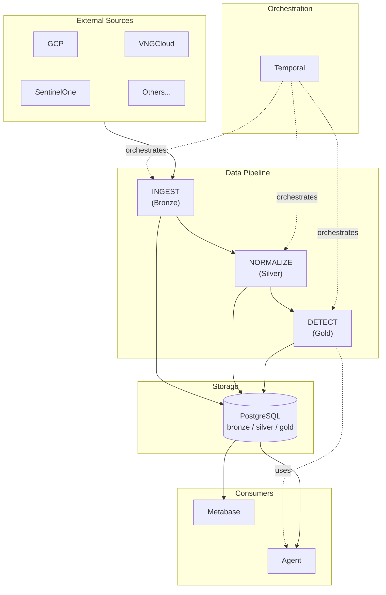
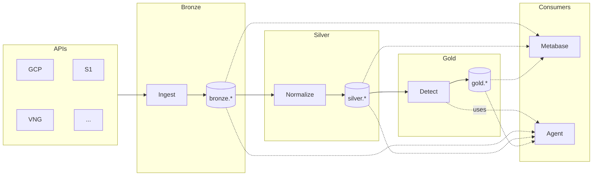

# Hotpot Architecture

## Overview

Hotpot follows the **Medallion Data Architecture** pattern, designed as independent microservices that can be deployed and scaled separately.



## Medallion Layers

| Layer | Package | Purpose | Data State |
|-------|---------|---------|------------|
| Bronze | `ingest/` | Collect raw data from external sources | Raw, as-is from API |
| Silver | `normalize/` | Clean, validate, unify data models | Normalized, enriched |
| Gold | `detect/` | Alerts, rules, compliance checks | Query-optimized, actionable |
| Agent | External | Text-to-SQL (WrenAI + Ollama / Vertex AI) | Read-only access to all layers |
| Admin | Metabase | Web interface for humans | Read-only access to all layers |

## Project Structure

```
hotpot/
├── bin/                        # Compiled binaries (gitignored)
│
├── cmd/                        # Thin entry points
│   ├── ingest/main.go
│   ├── normalize/main.go
│   └── detect/main.go
│
├── docs/                       # Documentation
│   ├── README.md               # Index
│   ├── architecture/           # System design
│   ├── guides/                 # How-to guides
│   ├── features/               # Feature docs
│   └── GLOSSARY.md
│
├── pkg/                        # Main packages
│   ├── base/                   # Shared utilities
│   │   └── models/             # Shared GORM models
│   │       ├── bronze/         # Bronze models by domain
│   │       ├── silver/         # Silver models (unified)
│   │       └── gold/           # Gold models
│   │
│   ├── ingest/                 # Bronze: data collection
│   │   ├── run.go
│   │   ├── gcp/
│   │   ├── vngcloud/
│   │   └── sentinelone/
│   │
│   ├── normalize/              # Silver: transformation
│   │   ├── run.go
│   │   ├── assets/
│   │   └── vulnerabilities/
│   │
│   └── detect/                 # Gold: analytics
│       ├── run.go
│       ├── rules/
│       └── alerts/
│
├── deploy/
│   ├── docker/
│   └── k8s/
│
├── Makefile
└── go.mod
```

## Microservices

Each layer runs as an independent Temporal worker. Admin UI uses Metabase (external service).

### Entry Point Pattern

```
cmd/ingest/main.go      →  imports pkg/ingest  →  calls ingest.Run()
cmd/normalize/main.go   →  imports pkg/normalize  →  calls normalize.Run()
cmd/detect/main.go      →  imports pkg/detect  →  calls detect.Run()
```

`cmd/` contains only thin `main.go` files. All logic lives in `pkg/`.

### Task Queues

| Service | Task Queue | Purpose |
|---------|------------|---------|
| ingest | `hotpot-ingest-gcp` | GCP inventory collection |
| ingest | `hotpot-ingest-vng` | VNGCloud collection |
| ingest | `hotpot-ingest-s1` | SentinelOne collection |
| ingest | `hotpot-ingest-fortinet` | Fortinet collection |
| normalize | `hotpot-normalize` | Data normalization |
| detect | `hotpot-detect` | Detection rules |

## Data Flow



## Database Schemas

Single PostgreSQL database with current and history schemas per layer:

```sql
CREATE SCHEMA bronze;          -- Current raw data
CREATE SCHEMA bronze_history;  -- Historical versions
CREATE SCHEMA silver;          -- Current normalized
CREATE SCHEMA silver_history;  -- Historical versions
CREATE SCHEMA gold;            -- Current analytics
CREATE SCHEMA gold_history;    -- Historical versions
```

| Schema | Purpose | Tables |
|--------|---------|--------|
| `bronze` | Current raw data | `gcp_compute_instances`, `gcp_compute_instance_nics`, ... |
| `bronze_history` | All versions | Same tables with `valid_from/valid_to` |
| `silver` | Current normalized | `assets`, `vulnerabilities`, `software` |
| `silver_history` | All versions | Same tables with `valid_from/valid_to` |
| `gold` | Current analytics | `compliance`, `alerts`, `mv_asset_summary` |
| `gold_history` | All versions | Same tables with `valid_from/valid_to` |

History uses SCD Type 4 with granular change tracking. See [HISTORY.md](./HISTORY.md).

**GORM model example** (in `pkg/base/models/bronze/gcp.go`):

```go
package bronze

type GCPInstance struct {
    ID   string `gorm:"primaryKey"`
    Name string
}

func (GCPInstance) TableName() string {
    return "bronze.gcp_instances"
}
```

## Module Structure

Each module in `pkg/` is self-contained with nested provider/resource structure:

```
pkg/ingest/
├── run.go                      # Entry: Run(), create workers
├── gcp/
│   ├── config.go               # GCP worker config
│   ├── register.go             # Register GCP workflows
│   ├── workflows.go            # GCPInventoryWorkflow
│   └── compute/
│       ├── register.go         # Register compute workflows
│       ├── workflows.go        # ComputeWorkflow (orchestrator)
│       └── instance/
│           ├── client.go       # GCP Compute API client
│           ├── service.go      # Ingest logic
│           ├── converter.go    # API → Bronze model
│           ├── activities.go   # Temporal activities (creates client)
│           ├── workflows.go    # InstanceWorkflow
│           └── register.go     # Register instance activities
├── vngcloud/
│   └── ...
└── sentinelone/
    └── ...
```

See [WORKFLOWS.md](../guides/WORKFLOWS.md) for workflow patterns and client lifecycle.

**Models live in `pkg/base/models/`** (not in each module):

```
pkg/base/models/
├── bronze/                          # Current state models
│   ├── gcp_compute_instance.go
│   ├── gcp_compute_instance_disk.go
│   ├── gcp_compute_instance_nic.go
│   └── ...
├── bronze_history/                  # History models (same structure)
│   ├── gcp_compute_instance.go
│   ├── gcp_compute_instance_disk.go
│   ├── gcp_compute_instance_nic.go
│   └── ...
├── silver/
│   └── assets.go
├── silver_history/
│   └── assets.go
└── gold/
    ├── alerts.go
    └── compliance.go
```

This allows all layers to import models without cross-layer dependencies:

```go
import (
    "hotpot/pkg/base/models/bronze"
    "hotpot/pkg/base/models/silver"
)
```

## Scaling

Each service can be scaled independently:

```
# Scale ingest workers for heavy collection
kubectl scale deployment hotpot-ingest --replicas=5

# Single normalize worker is enough
kubectl scale deployment hotpot-normalize --replicas=1

# Scale detect for real-time alerting
kubectl scale deployment hotpot-detect --replicas=3
```

## Tech Stack

| Component | Technology |
|-----------|------------|
| Language | Go |
| Workflow Engine | Temporal |
| Database | PostgreSQL + GORM |
| Dependency Injection | uber-go/dig |
| Admin UI | Metabase |
| Deployment | Docker + Kubernetes |

## Admin

Web interface for viewing data.

| Tool | Purpose |
|------|---------|
| Metabase | Data tables, dashboards, charts |

## Agent

AI-powered natural language interface. See [AGENT.md](../features/AGENT.md).

| Deployment | Stack | Use Case |
|------------|-------|----------|
| Local | WrenAI + Ollama | Dev, air-gapped, cost-sensitive |
| Enterprise | Vertex AI | Production, compliance required |