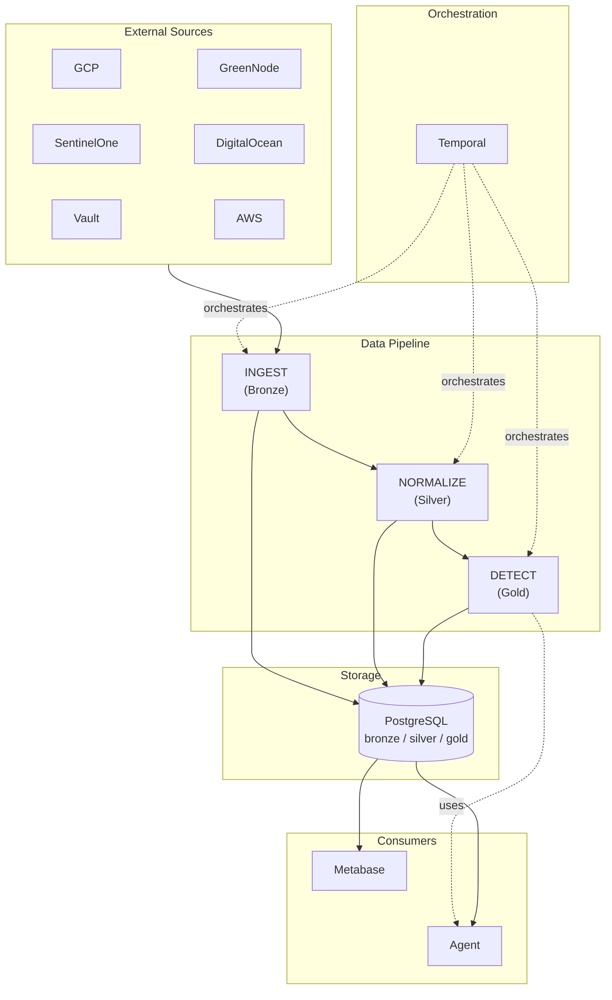
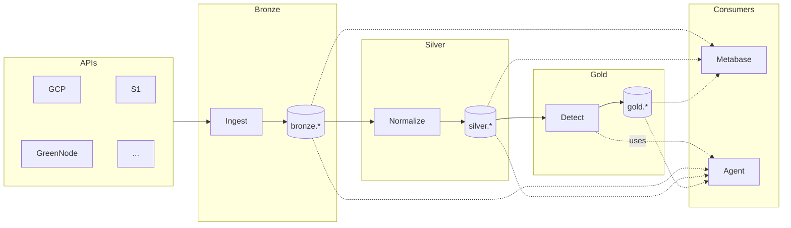

# Hotpot Architecture

Hotpot follows the **Medallion Data Architecture** pattern, designed as independent microservices that can be deployed and scaled separately.


```mermaid
flowchart TD
    subgraph Sources["External Sources"]
        GCP[GCP] ~~~ GN[GreenNode]
        S1[SentinelOne] ~~~ DO[DigitalOcean]
        VAULT[Vault] ~~~ AWS[AWS]
    end

    subgraph Orchestration["Orchestration"]
        TEMPORAL[Temporal] 
    end

    subgraph Pipeline["Data Pipeline"]
        INGEST["INGEST<br/>(Bronze)"] --> NORMALIZE["NORMALIZE<br/>(Silver)"] --> DETECT["DETECT<br/>(Gold)"]
    end

    subgraph Storage["Storage"]
        DB[(PostgreSQL<br/>bronze / silver / gold)]
    end

    subgraph Consumers["Consumers"]
        METABASE["Metabase"] ~~~ AGENT["Agent"]
    end

    Sources --> INGEST
    TEMPORAL -.->|orchestrates| INGEST & NORMALIZE & DETECT
    INGEST & NORMALIZE & DETECT --> DB
    DETECT -.->|uses| AGENT
    DB --> METABASE & AGENT
```

## 🏅 Medallion Layers

| Layer | Package | Purpose | Data State |
|-------|---------|---------|------------|
| Bronze | `ingest/` | Collect raw data from external sources | Raw, as-is from API |
| Silver | `normalize/` | Clean, validate, unify data models | Normalized, enriched |
| Gold | `detect/` | Alerts, rules, compliance checks | Query-optimized, actionable |
| Agent | External | Text-to-SQL (WrenAI + Ollama / Vertex AI) | Read-only access to all layers |
| Admin | Metabase | Web interface for humans | Read-only access to all layers |

## 📂 Project Structure

```
hotpot/
├── bin/                        # Compiled binaries (gitignored)
│
├── cmd/                        # Production binaries
│   ├── ingest/main.go
│   ├── normalize/main.go
│   ├── migrate/main.go
│   └── ...
│
├── tools/                      # Dev-only tools
│   ├── entcgen/main.go         # Ent code generation
│   ├── ingestgen/main.go       # Ingest binary import generation
│   └── genmigrate/main.go      # Migration SQL generation
│
├── docs/                       # Documentation
│   ├── README.md               # Index
│   ├── architecture/           # System design
│   ├── guides/                 # How-to guides
│   ├── features/               # Feature docs
│   └── reference/
│       ├── GLOSSARY.md
│       └── EXTERNAL_RESOURCES.md
│
├── pkg/                        # Main packages
│   ├── base/                   # Shared utilities
│   │   ├── config/             # Configuration
│   │   ├── app/                # Application setup
│   │   └── ratelimit/          # Rate limiting
│   │
│   ├── schema/                 # Ent schema definitions
│   │   ├── bronze/             # Bronze schemas
│   │   ├── bronzehistory/      # Bronze history schemas
│   │   ├── silver/             # Silver schemas
│   │   └── gold/               # Gold schemas
│   │
│   ├── storage/                # Generated ent code
│   │   ├── entc.go             # Schema auto-discovery
│   │   └── ent/                # Generated clients (DO NOT EDIT)
│   │       ├── client.go       # Monolithic client (migration only)
│   │       ├── gcp/compute/    # Per-service: GCP Compute
│   │       ├── gcp/vpn/        # Per-service: GCP VPN
│   │       ├── s1/             # Per-service: SentinelOne
│   │       ├── greennode/      # Per-service: GreenNode
│   │       ├── machine/         # Per-service: Silver Machine
│   │       └── ...
│   │
│   ├── ingest/                 # Bronze: data collection
│   │   ├── run.go
│   │   ├── registry.go         # Provider self-registration
│   │   ├── gcp/
│   │   ├── greennode/
│   │   ├── sentinelone/
│   │   ├── digitalocean/
│   │   ├── vault/
│   │   └── aws/
│   │
│   ├── normalize/              # Silver: transformation
│   │   ├── run.go
│   │   ├── register.go
│   │   └── machine/
│   │       ├── provider.go     # Provider interface + NormalizedMachine type
│   │       ├── merge.go        # MAC/IP dedup merge engine
│   │       ├── activities.go   # Temporal activities
│   │       ├── workflows.go    # Two-phase workflow
│   │       ├── register.go     # Wire activities + workflow
│   │       ├── s1/             # S1 provider
│   │       ├── meec/           # MEEC provider
│   │       ├── gcp/            # GCP provider
│   │       └── greennode/      # GreenNode provider
│   │
│   └── detect/                 # Gold: analytics
│       ├── run.go
│       ├── rules/
│       └── alerts/
│
├── deploy/
│   ├── docker/
│   └── k8s/
│
├── Makefile
└── go.mod
```

## 🔧 Microservices

Each layer runs as an independent Temporal worker. Admin UI uses Metabase (external service).

### Entry Point Pattern

```
cmd/ingest/main.go          →  imports all providers     →  calls ingest.Run()
cmd/ingest-gcp/main.go      →  imports GCP provider only →  calls ingest.Run()
cmd/ingest-greennode/main.go →  imports GreenNode only    →  calls ingest.Run()
cmd/normalize/main.go       →  imports normalize pkg      →  calls normalize.Run()
cmd/migrate/main.go          →  imports pkg/migrate       →  calls migrate.Run()
```

Per-provider binaries import only the provider they need, resulting in smaller binaries. `cmd/` contains only production binaries. Dev tools live in `tools/`. All logic lives in `pkg/`.

### Task Queues

| Service | Task Queue | Purpose |
|---------|------------|---------|
| ingest | `hotpot-ingest-gcp` | GCP inventory collection |
| ingest | `hotpot-ingest-greennode` | GreenNode collection |
| ingest | `hotpot-ingest-s1` | SentinelOne collection |
| ingest | `hotpot-ingest-do` | DigitalOcean collection |
| ingest | `hotpot-ingest-vault` | Vault collection |
| ingest | `hotpot-ingest-aws` | AWS collection |
| normalize | `normalize` | Machine normalization (silver layer) |
| detect | `hotpot-detect` | Detection rules |

## 🔄 Data Flow


```mermaid
flowchart LR
    subgraph Sources["APIs"]
        GCP[GCP] ~~~ GN[GreenNode]
        S1[S1] ~~~ OTHER[...]
    end

    subgraph Bronze["Bronze"]
        INGEST[Ingest]
        bronze[(bronze.*)]
    end

    subgraph Silver["Silver"]
        NORMALIZE[Normalize]
        silver[(silver.*)]
    end

    subgraph Gold["Gold"]
        DETECT[Detect]
        gold[(gold.*)]
    end

    subgraph Consumers["Consumers"]
        METABASE[Metabase]
        AGENT[Agent]
    end

    Sources --> INGEST --> bronze
    bronze --> NORMALIZE --> silver
    silver --> DETECT --> gold
    DETECT -.->|uses| AGENT

    bronze & silver & gold -.-> METABASE
    bronze & silver & gold -.-> AGENT
```

## 🗄️ Database Schemas

Single PostgreSQL database with current and history schemas per layer:

```sql
CREATE SCHEMA bronze;          -- Current raw data
CREATE SCHEMA bronze_history;  -- Historical versions
CREATE SCHEMA silver;          -- Current normalized
CREATE SCHEMA silver_history;  -- Historical versions
CREATE SCHEMA gold;            -- Current analytics
CREATE SCHEMA gold_history;    -- Historical versions
```

| Schema | Purpose | Tables |
|--------|---------|--------|
| `bronze` | Current raw data | `gcp_compute_instances`, `gcp_compute_instance_nics`, ... |
| `bronze_history` | All versions | Same tables with `valid_from/valid_to` |
| `silver` | Current normalized | `machines`, `machine_normalized`, `machine_bronze_links` |
| `silver_history` | All versions | (not yet implemented) |
| `gold` | Current analytics | `compliance`, `alerts`, `mv_asset_summary` |
| `gold_history` | All versions | Same tables with `valid_from/valid_to` |

History uses SCD Type 4 with granular change tracking. See [HISTORY.md](./HISTORY.md).

**Ent schema example** (in `pkg/schema/bronze/gcp/compute/instance.go`):

```go
package compute

type BronzeGCPComputeInstance struct {
    ent.Schema
}

func (BronzeGCPComputeInstance) Fields() []ent.Field {
    return []ent.Field{
        field.String("id").StorageKey("resource_id").Immutable(),
        field.String("name").NotEmpty(),
    }
}

func (BronzeGCPComputeInstance) Annotations() []schema.Annotation {
    return []schema.Annotation{
        entsql.Annotation{Table: "gcp_compute_instances"},
    }
}
```

## 📦 Module Structure

Each module in `pkg/` is self-contained with nested provider/resource structure:

```
pkg/ingest/
├── run.go                      # Entry: Run(), create workers
├── registry.go                 # Provider + service self-registration
├── gcp/                        # Provider → service → resource hierarchy
│   ├── provider.go             # Provider init() + RegisterProvider
│   ├── register.go             # Loops ingest.Services("gcp")
│   ├── workflows.go            # GCPInventoryWorkflow (dynamic child dispatch)
│   └── compute/
│       ├── provider.go         # Service init() + RegisterService
│       ├── register.go         # Register compute workflows
│       ├── workflows.go        # ComputeWorkflow (orchestrator)
│       └── instance/
│           ├── client.go       # GCP Compute API client
│           ├── service.go      # Ingest logic
│           ├── converter.go    # API → Bronze model
│           ├── activities.go   # Temporal activities (creates client)
│           ├── workflows.go    # InstanceWorkflow
│           └── register.go     # Register instance activities
├── sentinelone/                # Provider → services
│   ├── provider.go             # Provider init() + RegisterProvider
│   ├── register.go             # Loops ingest.Services("sentinelone")
│   ├── workflows.go            # S1InventoryWorkflow (dynamic child dispatch)
│   └── agent/
│       ├── provider.go         # Service init() + RegisterService
│       ├── register.go         # Register agent activities + workflow
│       ├── activities.go       # Temporal activities
│       ├── workflows.go        # S1AgentWorkflow
│       └── ...
├── greennode/                  # Same dynamic registration pattern
│   └── ...
└── ...
```

See [WORKFLOWS.md](../guides/WORKFLOWS.md) for workflow patterns and client lifecycle.

**Ent schemas live in `pkg/schema/`** (not in each module):

```
pkg/schema/
├── bronze/                          # Current state schemas
│   ├── mixin/                       # Shared mixins
│   │   └── timestamp.go
│   └── gcp/
│       ├── compute/
│       │   ├── instance.go          # BronzeGCPComputeInstance + children
│       │   ├── disk.go
│       │   └── ...
│       ├── networking/
│       └── ...
├── bronzehistory/                   # History schemas
│   └── gcp/
│       ├── compute/
│       │   ├── instance.go          # BronzeHistoryGCPComputeInstance + children
│       │   └── ...
│       └── ...
├── silver/
│   ├── mixin/
│   │   └── timestamp.go        # Silver timestamp mixin
│   └── machine/
│       ├── silver_machine.go
│       ├── silver_machine_normalized.go
│       └── silver_machine_bronze_link.go
└── gold/
    ├── compliance/
    └── alerts/
```

Ent generates **per-service clients** in `pkg/storage/ent/{provider}/{service}/`:

```go
import entcompute "hotpot/pkg/storage/ent/gcp/compute"

// Per-service client — only includes types for that service
client := entcompute.NewClient(entcompute.Driver(driver), entcompute.AlternateSchema(entcompute.DefaultSchemaConfig()))
client.BronzeGCPComputeInstance.Query()...
```

Each provider binary only links the ent types it uses, reducing binary size significantly.

## 📈 Scaling

Each service can be scaled independently:

```
# Scale ingest workers for heavy collection
kubectl scale deployment hotpot-ingest --replicas=5

# Single normalize worker is enough
kubectl scale deployment hotpot-normalize --replicas=1

# Scale detect for real-time alerting
kubectl scale deployment hotpot-detect --replicas=3
```

## ⚙️ Tech Stack

| Component | Technology |
|-----------|------------|
| Language | Go |
| Workflow Engine | Temporal |
| Database | PostgreSQL + Ent |
| Database Driver | dialect.Driver (shared, per-service clients created from it) |
| Admin UI | Metabase |
| Deployment | Docker + Kubernetes |

## 🖥️ Admin

Web interface for viewing data.

| Tool | Purpose |
|------|---------|
| Metabase | Data tables, dashboards, charts |

## 🤖 Agent

AI-powered natural language interface. See [AGENT.md](../features/AGENT.md).

| Deployment | Stack | Use Case |
|------------|-------|----------|
| Local | WrenAI + Ollama | Dev, air-gapped, cost-sensitive |
| Enterprise | Vertex AI | Production, compliance required |