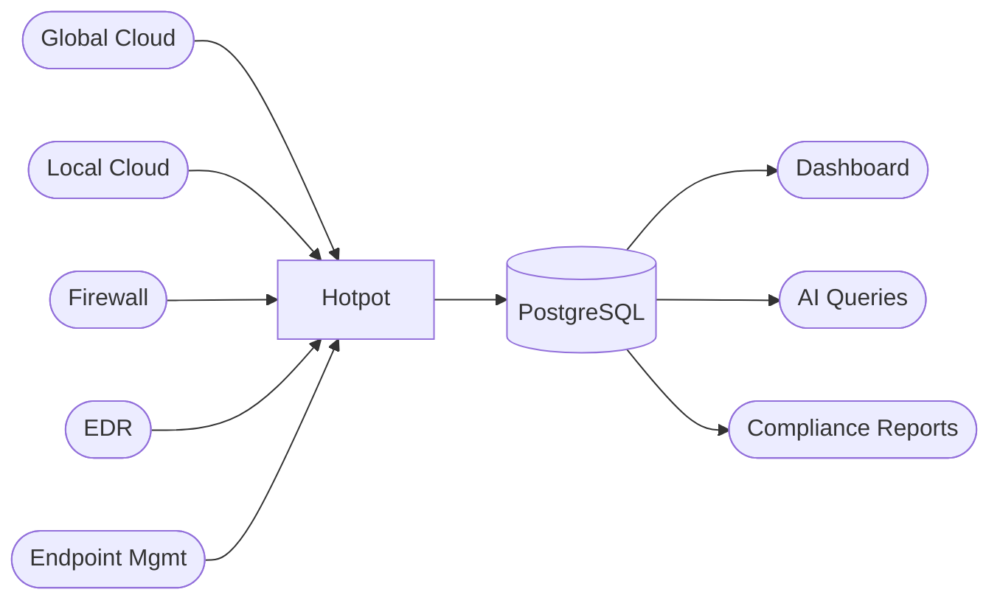

# ADR 001: Build vs Buy Decision

## Status
Accepted

## Date
2024 (Project inception)

## Context
Evaluating whether to build Hotpot in-house or purchase a commercial CMDB solution.

## Summary
No vendor supports local cloud providers, native firewall policy-to-asset mapping, or local regulatory reporting. Buying adds cost and consulting dependency without eliminating the build effort.

## Requirements

| # | Requirement | Driver |
|---|------------|--------|
| 1 | Multi-cloud asset inventory (global + local cloud) | Local regulation |
| 2 | Firewall policy-to-asset mapping | Local regulation |
| 3 | EDR agent coverage per asset | NIST CSF 2.0 |
| 4 | Endpoint management coverage | Local regulation |
| 5 | EoS/EoL tracking | Local regulation |
| 6 | Regulatory compliance reporting | Local regulation |
| 7 | Change tracking with audit trail | Local regulation |

## Evaluated Options

### ServiceNow ITOM

| Requirement | Status | Notes |
|------------|--------|-------|
| Global cloud discovery | ✅ | Service Graph Connector + MID Server |
| Local cloud discovery | ❌ | No connector for local cloud providers |
| Firewall device discovery | ✅ | OOTB pattern, hardware only |
| Firewall policy-to-asset mapping | ❌ | Consulting required |
| EDR CMDB sync | ⚠️ | Imports hardware assets, not coverage gaps |
| Endpoint management integration | ❌ | No native connector |
| Local regulatory reporting | ❌ | No templates for local regulations |

**Estimated cost:** ~$50,000+/year (license + consulting at $30–80/hr)

### Device42

| Requirement | Status | Notes |
|------------|--------|-------|
| Global cloud discovery | ✅ | Autodiscovery with Kubernetes support |
| Local cloud discovery | ❌ | Only major global providers supported |
| Firewall device discovery | ✅ | SNMP-based, hardware only |
| Firewall policy-to-asset mapping | ❌ | Cannot pull policy-to-asset relationships |
| EDR integration | ❌ | No connector |
| Endpoint management integration | ❌ | No connector |
| Local regulatory reporting | ❌ | No support for local regulations |

**Estimated cost:** ~$5,000–10,000/year (by device count)

## Buy vs Build

Buying does not eliminate custom development. It adds a license fee and consulting dependency on top of the same work.

| Task | Buy | Build |
|------|-----|-------|
| Local cloud collector | Custom dev + consulting | Already built |
| Firewall policy → asset mapping | Consulting | Built in-house |
| EDR coverage correlation | Custom logic | Built in-house |
| Endpoint management integration | Custom API | Built in-house |
| Local regulatory reports | Consulting | Built in-house |
| Ongoing maintenance | Vendor + consultants | Internal team |

## Cost

| | Build | ServiceNow | Device42 |
|---|---|---|---|
| Platform license | $0 | ~$50,000+/yr | ~$5,000–10,000/yr |
| Custom integration | $0 | $20,000–50,000 | $20,000–50,000 |
| Consulting | $0 | $10,000–30,000/yr | $10,000–20,000/yr |
| Time to production | 3–6 months | 6–12 months | 6–12 months |
| Maintenance | Internal | Vendor + consultants | Vendor + consultants |

## Risk

| Concern | Impact |
|---------|--------|
| Consultant dependency | Mappings built by consultants who don't maintain them |
| Infrastructure changes | New cloud regions, firewall changes, API updates require re-engaging consultants |
| Vendor lock-in | Custom integrations tied to vendor platform, not portable |
| Local knowledge gap | No vendor understands local cloud providers or local regulations |

## When Buying Makes Sense

| Condition | Status |
|-----------|--------|
| All infrastructure on globally supported clouds | Not now |
| Vendors add native firewall policy-to-asset mapping | Not available |
| Vendors provide local regulatory reporting templates | Not available |
| Budget for license + permanent consulting retainer | Not now |

## Decision

| Factor | Buy | Build |
|--------|-----|-------|
| Local cloud support | ❌ | ✅ |
| Firewall policy-to-asset mapping | Consulting | ✅ |
| Local regulatory compliance | Consulting | ✅ |
| Year 1 cost | $80,000–130,000 | $0 (dev time) |
| External dependency | High | None |
| Time to value | 6–12 months | 3–6 months |

**Build.** No vendor supports local cloud providers, native firewall policy-to-asset mapping, or local regulatory reporting. Buying adds cost and dependency without eliminating the build effort.