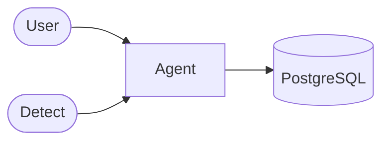

# Agent

AI-powered natural language interface for querying Hotpot data.



## LLM Providers

| Deployment | Stack | Use Case |
|------------|-------|----------|
| Local | WrenAI + Ollama | Dev, air-gapped, cost-sensitive |
| Enterprise | Vertex AI | Production, compliance required |

### WrenAI + Ollama

Text-to-SQL semantic layer (WrenAI) with local LLM inference (Ollama). No data leaves your infrastructure.

| Model | Size | RAM | Speed | License |
|-------|------|-----|-------|---------|
| `qwen2.5-coder:14b` | 9GB | ~14GB | ~10 tok/s | Apache 2.0 |
| `qwen2.5-coder:7b` | 4.5GB | ~8GB | ~20 tok/s | Apache 2.0 |
| `llama3.1:8b` | 4.5GB | ~8GB | ~18 tok/s | Llama 3.1 |

**Primary:** `qwen2.5-coder:7b-instruct`
- Best SQL/code benchmark in 7B class
- Fits 8GB RAM with fast inference (~20 tok/s)
- Apache 2.0 license (commercial OK)

**Alternative:** `qwen2.5-coder:14b` for complex multi-table joins or reasoning tasks.

### Vertex AI

Managed Gemini models with VPC Service Controls.

```yaml
agent:
  provider: vertex
  project_id: "your-project"
  location: "asia-southeast1"
  model: "gemini-2.0-flash"
```

## Tools

| Tool | Purpose | Constraints |
|------|---------|-------------|
| Query | Execute SQL | `SELECT` only, 100 row limit |
| Schema | Inspect DB structure | Tables, columns, relationships |

## Security Use Cases

Agent analyzes security findings from the Detect layer:

| Use Case | Description | Sources |
|----------|-------------|---------|
| VM without Firewall | Compute instances not associated with any firewall rules | GCP, VNGCloud |
| Asset without EDR | Servers or endpoints missing SentinelOne agent installation | GCP, SentinelOne |
| Public IP Exposure | VMs with public IPs but no WAF or firewall protection | GCP, VNGCloud |
| Unpatched Critical CVE | Assets with CVSS 9+ vulnerabilities not remediated within 7 days | Tenable |
| Orphan Firewall Rules | Firewall rules pointing to deleted or non-existent resources | Fortinet, GCP |
| Shadow IT | Assets discovered in environment but not registered in CMDB | All |
| Stale Service Accounts | GCP service accounts with no activity in the last 90 days | GCP IAM |
| Overly Permissive Rules | Firewall rules allowing 0.0.0.0/0 on sensitive ports (SSH, RDP, DB) | Fortinet, GCP |
| Missing Encryption | Disks or storage buckets without encryption enabled | GCP, VNGCloud |

## Security

| Concern | Mitigation |
|---------|------------|
| SQL Injection | Query validation, `SELECT` only |
| Data Access | Read-only connection |
| Prompt Injection | Input sanitization |
| Data Privacy | Local LLM or VPC-controlled Vertex AI |