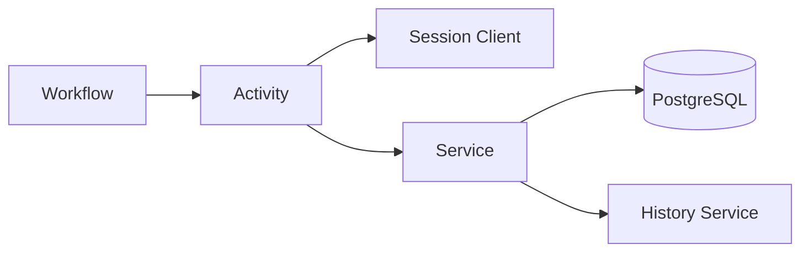

# Activities

Temporal activities for data ingestion and processing.



## File Structure

```
pkg/ingest/{provider}/{resource}/
├── activities.go    # Activity struct + methods
├── session.go       # Session-based client management
├── service.go       # Business logic (CRUD + history)
├── register.go      # Register with Temporal worker
└── workflows.go     # Workflow calling activities
```

## Activity Struct

Hold dependencies, not state:

```go
type Activities struct {
    credentialsFile string   // Credentials path (client created per session)
    db              *gorm.DB
}

func NewActivities(credentialsFile string, db *gorm.DB) *Activities {
    return &Activities{credentialsFile: credentialsFile, db: db}
}
```

## Params/Result Structs

Dedicated structs for each activity:

```go
// Params: inputs to activity
type IngestComputeInstancesParams struct {
    SessionID string  // Required for session-based client
    ProjectID string
}

// Result: outputs from activity
type IngestComputeInstancesResult struct {
    ProjectID      string
    InstanceCount  int
    DurationMillis int64
}
```

## Activity Function Reference

Export a variable for workflow registration:

```go
// Function reference for workflow ExecuteActivity
var IngestComputeInstancesActivity = (*Activities).IngestComputeInstances
```

**Why:** Allows type-safe activity execution in workflows.

## Activity Method

```go
func (a *Activities) IngestComputeInstances(ctx context.Context, params IngestComputeInstancesParams) (*IngestComputeInstancesResult, error) {
    logger := activity.GetLogger(ctx)
    logger.Info("Starting ingestion", "projectID", params.ProjectID)

    // 1. Get session client
    client, err := GetOrCreateSessionClient(ctx, params.SessionID, a.credentialsFile)
    if err != nil {
        return nil, fmt.Errorf("get client: %w", err)
    }

    // 2. Create service and execute
    service := NewService(client, a.db)
    result, err := service.Ingest(ctx, IngestParams{ProjectID: params.ProjectID})
    if err != nil {
        return nil, fmt.Errorf("ingest: %w", err)
    }

    // 3. Cleanup (delete stale)
    if err := service.DeleteStaleInstances(ctx, params.ProjectID, result.CollectedAt); err != nil {
        logger.Warn("Failed to delete stale", "error", err)
    }

    // 4. Return result
    return &IngestComputeInstancesResult{
        ProjectID:      result.ProjectID,
        InstanceCount:  result.InstanceCount,
        DurationMillis: result.DurationMillis,
    }, nil
}
```

## Session Client

Client lives for workflow duration, not worker lifetime:

```go
var sessionClients sync.Map

func GetOrCreateSessionClient(ctx context.Context, sessionID, credentialsFile string) (*Client, error) {
    if client, ok := sessionClients.Load(sessionID); ok {
        return client.(*Client), nil
    }
    client, err := NewClient(ctx, option.WithCredentialsFile(credentialsFile))
    if err != nil {
        return nil, err
    }
    sessionClients.Store(sessionID, client)
    return client, nil
}

func CloseSessionClient(sessionID string) {
    if client, ok := sessionClients.LoadAndDelete(sessionID); ok {
        client.(*Client).Close()
    }
}
```

**Cleanup activity:**

```go
var CloseSessionClientActivity = (*Activities).CloseSessionClient

func (a *Activities) CloseSessionClient(ctx context.Context, params CloseSessionClientParams) error {
    CloseSessionClient(params.SessionID)
    return nil
}
```

## Registration

```go
func Register(w worker.Worker, credentialsFile string, db *gorm.DB) {
    activities := NewActivities(credentialsFile, db)
    w.RegisterActivity(activities.IngestComputeInstances)
    w.RegisterActivity(activities.CloseSessionClient)
    w.RegisterWorkflow(InstanceWorkflow)
}
```

## Workflow Calling

```go
func InstanceWorkflow(ctx workflow.Context, params InstanceWorkflowParams) (*InstanceWorkflowResult, error) {
    // Create session
    sess, _ := workflow.CreateSession(ctx, &workflow.SessionOptions{
        CreationTimeout:  time.Minute,
        ExecutionTimeout: 15 * time.Minute,
    })
    sessionID := workflow.GetSessionInfo(sess).SessionID

    // Cleanup on exit
    defer func() {
        workflow.ExecuteActivity(sess, CloseSessionClientActivity, CloseSessionClientParams{SessionID: sessionID})
        workflow.CompleteSession(sess)
    }()

    // Execute activity
    var result IngestComputeInstancesResult
    err := workflow.ExecuteActivity(sess, IngestComputeInstancesActivity, IngestComputeInstancesParams{
        SessionID: sessionID,
        ProjectID: params.ProjectID,
    }).Get(ctx, &result)

    return &InstanceWorkflowResult{...}, err
}
```

## Checklist

New activity implementation:

| Step | File | Action |
|------|------|--------|
| 1 | `activities.go` | Add `*Params` struct |
| 2 | `activities.go` | Add `*Result` struct |
| 3 | `activities.go` | Add activity function reference variable |
| 4 | `activities.go` | Implement activity method |
| 5 | `session.go` | Add session client functions (if new provider) |
| 6 | `service.go` | Implement business logic with history tracking |
| 7 | `register.go` | Register activity with worker |
| 8 | `workflows.go` | Call activity from workflow |

## Error Handling

| Scenario | Action |
|----------|--------|
| Client creation fails | Return error (Temporal retries) |
| Service error | Return error with context |
| Cleanup error (stale delete) | Log warning, don't fail activity |
| Session client not found | Create new client |

## History Integration

Service layer handles history tracking:

```go
// In service.go
func (s *Service) saveInstances(ctx context.Context, instances []bronze.GCPComputeInstance) error {
    // 1. Load existing
    // 2. Compute diff
    // 3. Skip if no changes (update collected_at only)
    // 4. Upsert instance
    // 5. Track history (CreateHistory or UpdateHistory)
}

func (s *Service) DeleteStaleInstances(ctx context.Context, projectID string, collectedAt time.Time) error {
    // 1. Find stale
    // 2. Close history
    // 3. Delete
}
```

See [HISTORY.md](../architecture/HISTORY.md) for history tracking details.
