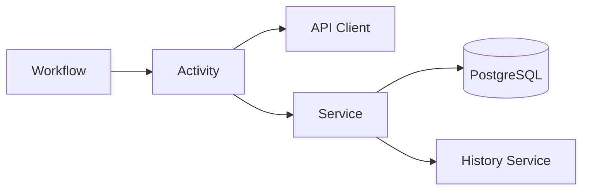

# Activities

Temporal activities for data ingestion and processing.



## File Structure

```
pkg/ingest/{provider}/{resource}/
├── client.go        # External API client wrapper
├── converter.go     # API response → Bronze model
├── diff.go          # Change detection between old/new
├── history.go       # SCD Type 4 history tracking
├── service.go       # Business logic (CRUD + history)
├── activities.go    # Activity struct + methods + createClient
├── workflows.go     # Workflow calling activities
└── register.go      # Register with Temporal worker
```

## Activity Struct

Hold dependencies, not state:

```go
type Activities struct {
    configService *config.Service
    db            *gorm.DB
    limiter       ratelimit.Limiter
}

func NewActivities(configService *config.Service, db *gorm.DB, limiter ratelimit.Limiter) *Activities {
    return &Activities{configService: configService, db: db, limiter: limiter}
}
```

## Client Creation

Each activity creates and closes its own client:

```go
// REST client (compute resources)
func (a *Activities) createClient(ctx context.Context) (*Client, error) {
    var opts []option.ClientOption
    if credJSON := a.configService.GCPCredentialsJSON(); len(credJSON) > 0 {
        opts = append(opts, option.WithAuthCredentialsJSON(option.ServiceAccount, credJSON))
    }
    opts = append(opts, option.WithHTTPClient(&http.Client{
        Transport: ratelimit.NewRateLimitedTransport(a.limiter, nil),
    }))
    return NewClient(ctx, opts...)
}

// gRPC client (container/cluster, resourcemanager/project)
// Replace WithHTTPClient with:
//   opts = append(opts, option.WithGRPCDialOption(
//       grpc.WithUnaryInterceptor(ratelimit.UnaryInterceptor(a.limiter)),
//   ))
```

## Params/Result Structs

Dedicated structs for each activity:

```go
// Params: inputs to activity
type IngestComputeInstancesParams struct {
    ProjectID string
}

// Result: outputs from activity
type IngestComputeInstancesResult struct {
    ProjectID      string
    InstanceCount  int
    DurationMillis int64
}
```

## Activity Function Reference

Export a variable for workflow registration:

```go
// Function reference for workflow ExecuteActivity
var IngestComputeInstancesActivity = (*Activities).IngestComputeInstances
```

**Why:** Allows type-safe activity execution in workflows.

## Activity Method

```go
func (a *Activities) IngestComputeInstances(ctx context.Context, params IngestComputeInstancesParams) (*IngestComputeInstancesResult, error) {
    logger := activity.GetLogger(ctx)
    logger.Info("Starting ingestion", "projectID", params.ProjectID)

    // 1. Create client
    client, err := a.createClient(ctx)
    if err != nil {
        return nil, fmt.Errorf("create client: %w", err)
    }
    defer client.Close()

    // 2. Create service and execute
    service := NewService(client, a.db)
    result, err := service.Ingest(ctx, IngestParams{ProjectID: params.ProjectID})
    if err != nil {
        return nil, fmt.Errorf("ingest: %w", err)
    }

    // 3. Cleanup (delete stale)
    if err := service.DeleteStaleInstances(ctx, params.ProjectID, result.CollectedAt); err != nil {
        logger.Warn("Failed to delete stale", "error", err)
    }

    // 4. Return result
    return &IngestComputeInstancesResult{
        ProjectID:      result.ProjectID,
        InstanceCount:  result.InstanceCount,
        DurationMillis: result.DurationMillis,
    }, nil
}
```

## Registration

```go
func Register(w worker.Worker, configService *config.Service, db *gorm.DB, limiter ratelimit.Limiter) {
    activities := NewActivities(configService, db, limiter)
    w.RegisterActivity(activities.IngestComputeInstances)
    w.RegisterWorkflow(InstanceWorkflow)
}
```

## Workflow Calling

```go
func InstanceWorkflow(ctx workflow.Context, params InstanceWorkflowParams) (*InstanceWorkflowResult, error) {
    activityOpts := workflow.ActivityOptions{
        StartToCloseTimeout: 10 * time.Minute,
        RetryPolicy: &temporal.RetryPolicy{
            InitialInterval:    time.Second,
            BackoffCoefficient: 2.0,
            MaximumInterval:    time.Minute,
            MaximumAttempts:    3,
        },
    }
    activityCtx := workflow.WithActivityOptions(ctx, activityOpts)

    var result IngestComputeInstancesResult
    err := workflow.ExecuteActivity(activityCtx, IngestComputeInstancesActivity, IngestComputeInstancesParams{
        ProjectID: params.ProjectID,
    }).Get(ctx, &result)

    return &InstanceWorkflowResult{...}, err
}
```

## Checklist

New resource implementation:

| Step | File | Action |
|------|------|--------|
| 1 | `client.go` | Wrap GCP API client, implement List method |
| 2 | `converter.go` | Convert API response → bronze model |
| 3 | `diff.go` | Implement change detection (parent + children) |
| 4 | `history.go` | Implement SCD Type 4 history tracking |
| 5 | `service.go` | Implement Ingest, save, delete stale with history |
| 6 | `activities.go` | Add createClient, Params/Result structs, activity var, method |
| 7 | `workflows.go` | Create workflow with activity execution |
| 8 | `register.go` | Register activities + workflow with worker |
| 9 | parent `register.go` | Import and call `Register()` |
| 10 | parent `workflows.go` | Add child workflow execution |

## Error Handling

| Scenario | Action |
|----------|--------|
| Client creation fails | Return error (Temporal retries) |
| Service error | Return error with context |
| Cleanup error (stale delete) | Log warning, don't fail activity |

## History Integration

Service layer handles history tracking:

```go
// In service.go
func (s *Service) saveInstances(ctx context.Context, instances []bronze.GCPComputeInstance) error {
    // 1. Load existing with Preload (all relations)
    // 2. Compute diff
    // 3. Skip if no changes (update collected_at only)
    // 4. Delete old relations (manual cascade)
    // 5. Upsert resource
    // 6. Create new relations
    // 7. Track history (CreateHistory or UpdateHistory based on diff)
}

func (s *Service) DeleteStaleInstances(ctx context.Context, projectID string, collectedAt time.Time) error {
    // 1. Find stale (collected_at < latest)
    // 2. Close history (set valid_to)
    // 3. Delete relations
    // 4. Delete resource
}
```

See [HISTORY.md](../architecture/HISTORY.md) for history tracking details.
